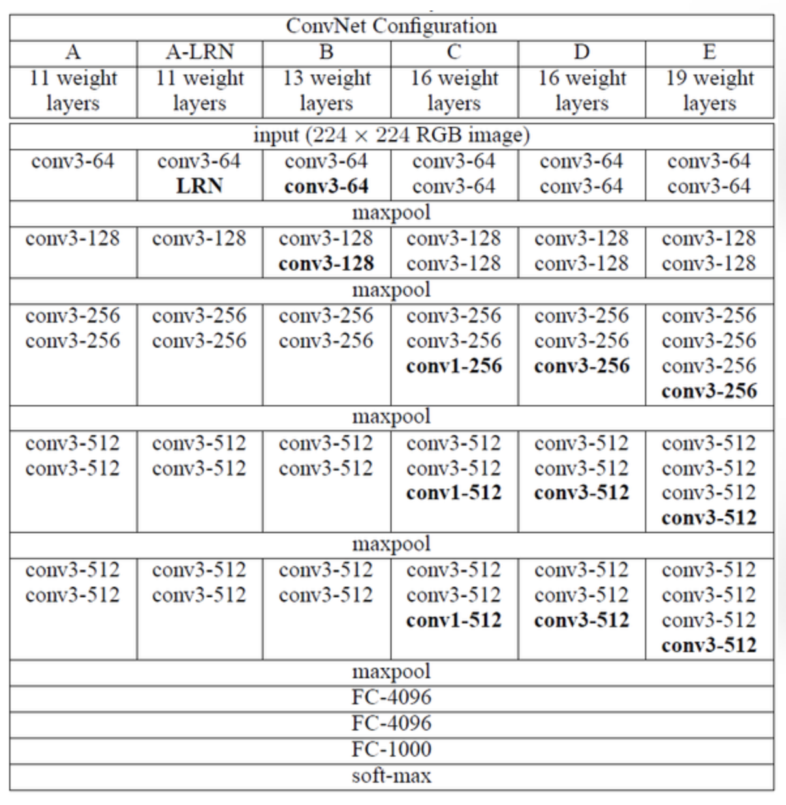
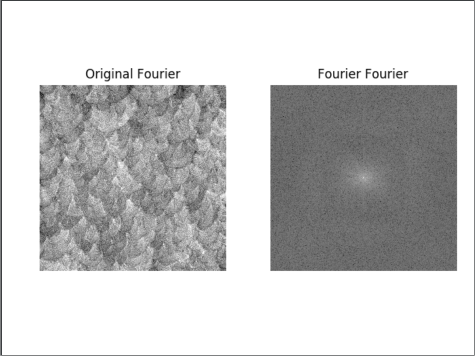

# Data Augmentation towards Feature map Visualization

#### Author: 孟荣业、康子健、詹钧翔、危文文、刘雨

### 

### How to config the environment?

```
conda env create -f env.yml
source activate filter_visualizer_env
```

```
env.yml文件里是环境的依赖。
```

### How to train the network?

```
python main_cifar.py
```

We choose the VGG11 network as our classification task's backbone, which has a moderate depth. Here is the layers of our network:



If we want get a high resolution vis-result of weights of filter, we need a high resolution input. While the resolution of the dataset cifar-10 is 32$\times$32，we up-sample the org-img to 128$\times$128，which help us get a high resolution img of filter's  weights. After 100 epoch's training, you can get the trained model. 

### How to vis the weight of the network?

```
python visualize.py --layer 0 --filter 84
```

To help you add the parameters of conv  layer and filter, here is the module of network, and you can check the index in it.

```
Sequential(
  (0): Conv2d(3, 64, kernel_size=(3, 3), stride=(1, 1), padding=(1, 1))
  (1): ReLU(inplace)
  (2): MaxPool2d(kernel_size=2, stride=2, padding=0, dilation=1, ceil_mode=False)
  (3): Conv2d(64, 128, kernel_size=(3, 3), stride=(1, 1), padding=(1, 1))
  (4): ReLU(inplace)
  (5): MaxPool2d(kernel_size=2, stride=2, padding=0, dilation=1, ceil_mode=False)
  (6): Conv2d(128, 256, kernel_size=(3, 3), stride=(1, 1), padding=(1, 1))
  (7): ReLU(inplace)
  (8): Conv2d(256, 256, kernel_size=(3, 3), stride=(1, 1), padding=(1, 1))
  (9): ReLU(inplace)
  (10): MaxPool2d(kernel_size=2, stride=2, padding=0, dilation=1, ceil_mode=False)
  (11): Conv2d(256, 512, kernel_size=(3, 3), stride=(1, 1), padding=(1, 1))
  (12): ReLU(inplace)
  (13): Conv2d(512, 512, kernel_size=(3, 3), stride=(1, 1), padding=(1, 1))
  (14): ReLU(inplace)
  (15): MaxPool2d(kernel_size=2, stride=2, padding=0, dilation=1, ceil_mode=False)
  (16): Conv2d(512, 512, kernel_size=(3, 3), stride=(1, 1), padding=(1, 1))
  (17): ReLU(inplace)
  (18): Conv2d(512, 512, kernel_size=(3, 3), stride=(1, 1), padding=(1, 1))
  (19): ReLU(inplace)
  (20): MaxPool2d(kernel_size=2, stride=2, padding=0, dilation=1, ceil_mode=False)
```

After vis operation, you can get following pics. For example:




### Data Augment Method

子健补充下实验结果
