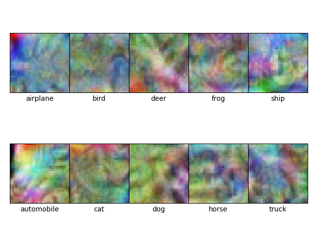
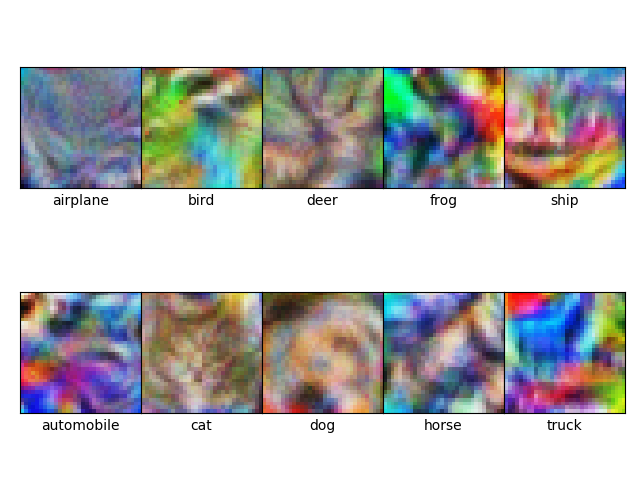
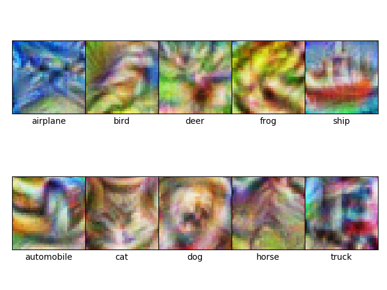
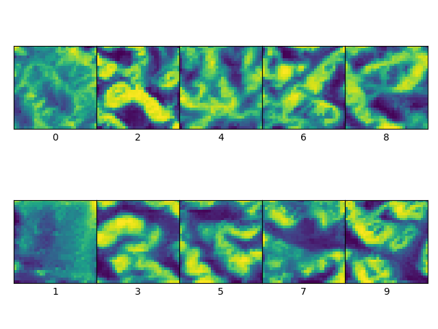
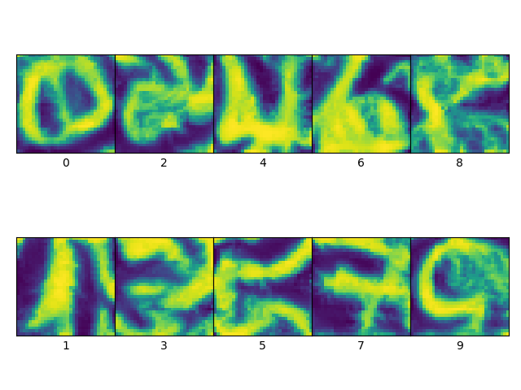

# Experiment3 of Data Augmentation towards Feature map Visualization

## Data Augment towards Feature Visualization

### How to config the environment?
torch.__version__ = 1.4.0+cu92
```
conda install pytorch torchvision cudatoolkit=9.2 -c pytorch
```

### How to train the network?

使用ResNet18在CIFAR-10数据集上训练，并且可设置不同Augmentation对网络进行训练。

```
python main_cifar.py
```

为MNIST设计了一个规模较小的网络，其中一共有4个Stage，每个Stage包含两层卷积层，使用了BatchNormalization和LeakyReLU，同样可设置是否使用Aug

```
python main.py
```


### How to visualize the feature map of the network?

```
python visualize_cifar.py
python visualize_mnist.py
```
分别显示在cifar和mnist上训练网络的特征图分类可视化结果
可通过设置加载不同的.pt参数，比较AUG的影响

##### cifar+no_Aug


##### cifar+flip_Aug


##### cifar+strong_Aug




##### mnist+no_Aug

##### mnist+Aug



